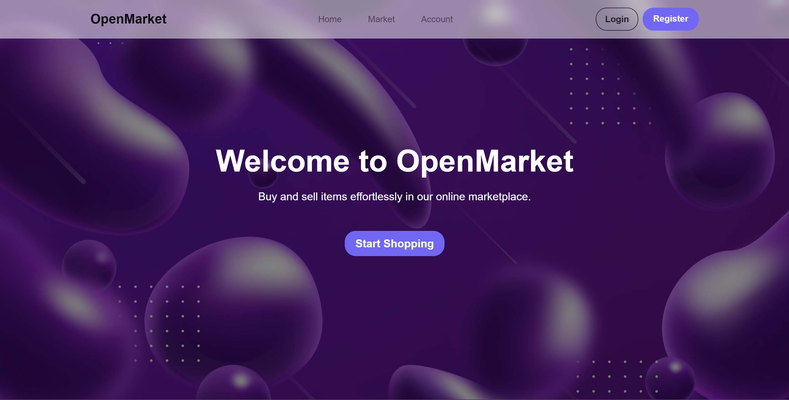
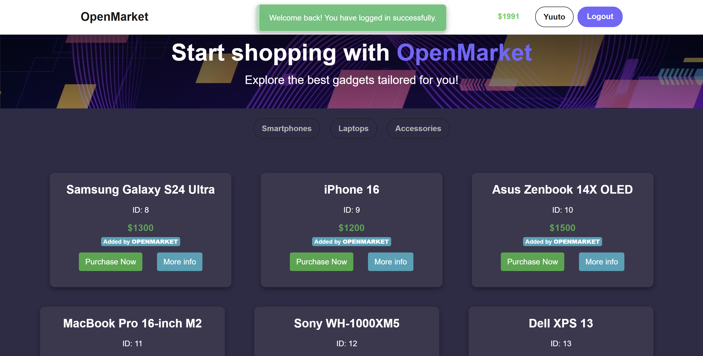
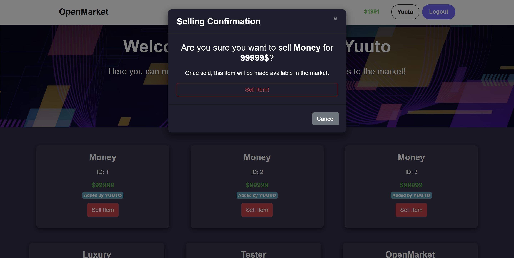

# OpenMarket

- [Overview](#overview)
- [Project Preview](#project-preview)
- [Usage](#usage)
- [User Manual](#user-manual)

---

## Overview
OpenMarket is a dynamic and user-friendly web application that allows users to buy and sell items with ease. Users can create accounts, list items for sale, and purchase items listed by others. The application also includes a budget tracker.

---

## Project Preview
Below are some preview images showcasing the OpenMarket platform:






---

## Usage
To run the OpenMarket application on your local machine, follow these steps:

1. **Clone the Repository:**  
   ```bash
   git clone <[repository-link](https://github.com/yuutoa/open-market.git)>
   cd OpenMarketProject
   ```

2. **Create and Activate Virtual Environment:**  
   ```bash
   python -m venv venv
   .\venv\Scripts\activate  # On MacOS use: source venv/bin/activate
   ```

   Alternatively, you can use Poetry to create and activate the environment:  
   ```bash
   poetry install
   poetry shell
   ```

3. **Install Dependencies:**  
   ```bash
   pip install -r requirements.txt
   ```
4. **Create SQLite database and make migrations**
```bash
flask db init
flask db migrate
flask db upgrade
```

5. **Run the Application:**  
   ```bash
   python run.py
   ```
   **Note:** `debug=True` in your configuration.

6. **Access the Application:**  
   Open your browser and go to: [http://127.0.0.1:5000](http://127.0.0.1:5000)

7. **Usage Instructions:**  
   - Create an account, add items, and sell items.

---

## User Manual
For more detailed guidance on how to use OpenMarket, please refer to the [OpenMarketUserManual](docs/OpenMarketUserManual).

---

[Yuuto Akihiro](https://github.com/yuutoa)

